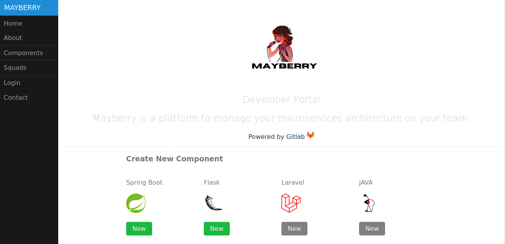
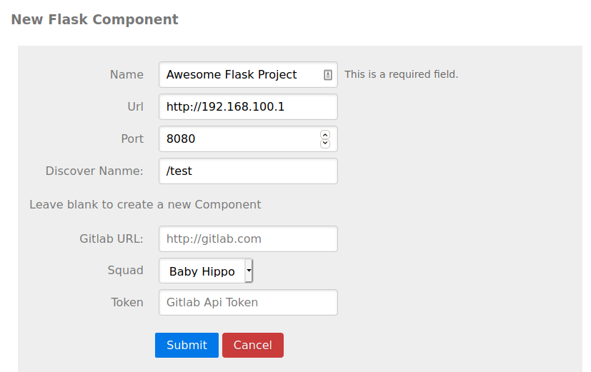
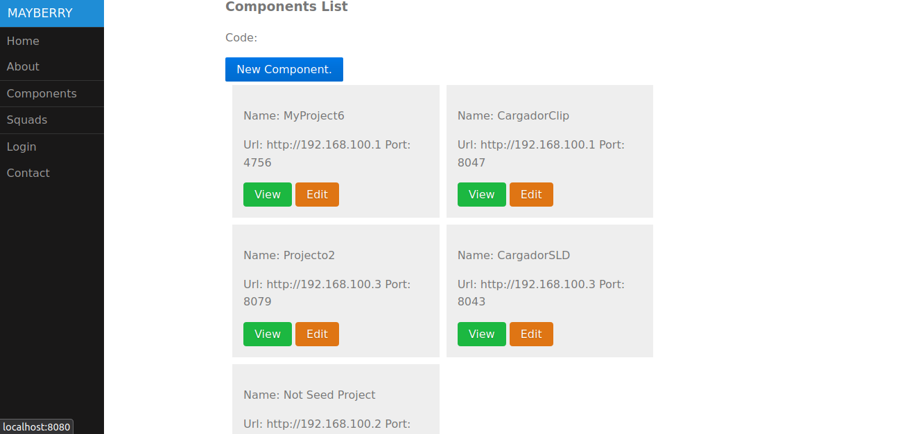
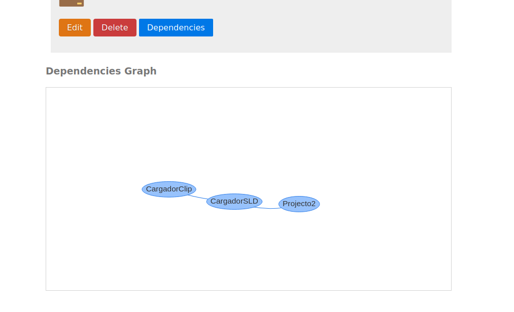

# MAYBERRY 
### The Developer Portal For The Agile Team

---
Mayberry is an effort to help teams on the manage and creation of software components as (Microservices, Libraries  and more ).

With Mayberry you can add existing software components of your systems or can create new ones based on seed project that has yout base infrastructure need as (Data Base Conection, Docker Deployment Taks, etc...)

See an overview of your Systems components, responsibles teams (Squads).

See the dependencies graph of each of your components and the state of the connections.

### DEPENDENCIES CATALOG
| Level | Name       | Description                                          |
|-------|------------|------------------------------------------------------|
| 1     | Functional | Service A functionality depends on Service B results |
| 2     | Storage    | Service A stores data into service B                 |